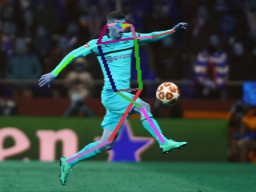

# Rethinking on Multi-Stage Networks for Human Pose Estimation

This repo is also linked to [github](https://github.com/megvii-detection/MSPN).

## This Version

This repo simply makes a training and testing these models easy by removing duplicate code and fixing things here and there. To run an example simply do:
```
python3 test.py --image https://media.npr.org/assets/img/2019/01/02/gettyimages-1058306908-0b38ff8a90d7bf88fea3133d8b72498665f63e12.jpg

----------------------------------------------------------------------
:: Loading the model
fetching https://media.npr.org/assets/img/2019/01/02/gettyimages-1058306908-0b38ff8a90d7bf88fea3133d8b72498665f63e12.jpg
:: out.size(): torch.Size([3, 256, 192])
:: Pass through model
:: Writing image at sample.png
----------------------------------------------------------------------
```




### To ONNX

To convert this to openVINO I need to convert this to ONNX Runtime, however that does not work correctly:
```
/usr/local/lib/python3.9/site-packages/torch/onnx/utils.py:299: UserWarning: It is recommended that constant folding be turned off ('do_constant_folding=False') when exporting the model in training-amenable mode, i.e. with 'training=TrainingMode.TRAIN' or 'training=TrainingMode.PRESERVE' (when model is in training mode). Otherwise, some learnable model parameters may not translate correctly in the exported ONNX model because constant folding mutates model parameters. Please consider turning off constant folding or setting the training=TrainingMode.EVAL.
  warnings.warn("It is recommended that constant folding be turned off ('do_constant_folding=False') "
/usr/local/lib/python3.9/site-packages/torch/onnx/symbolic_helper.py:266: UserWarning: You are trying to export the model with onnx:Upsample for ONNX opset version 9. This operator might cause results to not match the expected results by PyTorch.
ONNX's Upsample/Resize operator did not match Pytorch's Interpolation until opset 11. Attributes to determine how to transform the input were added in onnx:Resize in opset 11 to support Pytorch's behavior (like coordinate_transformation_mode and nearest_mode).
We recommend using opset 11 and above for models using this operator. 
  warnings.warn("You are trying to export the model with " + onnx_op + " for ONNX opset version "
/usr/local/lib/python3.9/site-packages/torch/onnx/symbolic_helper.py:182: UserWarning: ONNX export failed on upsample_bilinear2d because align_corners == True not supported
  warnings.warn("ONNX export failed on " + op + " because " + msg + " not supported")
```

## Introduction
This is a pytorch realization of MSPN proposed in [ Rethinking on Multi-Stage Networks for Human Pose Estimation ][1]. In this work, we design an effective network MSPN to fulfill human pose estimation task.

Existing pose estimation approaches fall into two categories: single-stage and multi-stage methods. While multistage methods are seemingly more suited for the task, their performance in current practice is not as good as singlestage methods. This work studies this issue. We argue that the current multi-stage methods’ unsatisfactory performance comes from the insufficiency in various design choices. We propose several improvements, including the single-stage module design, cross stage feature aggregation, and coarse-tofine supervision. 


The resulting method establishes the new state-of-the-art on both MS COCO and MPII Human Pose dataset, justifying the effectiveness of a multi-stage architecture.

### Model
Download ImageNet pretained ResNet-50 model from [Google Drive][6], and put it into **$MSPN_HOME/lib/models/**. For your convenience, We also provide a well-trained 2-stage MSPN model for COCO.


## Citation
Please considering citing our projects in your publications if they help your research.
```
@article{li2019rethinking,
  title={Rethinking on Multi-Stage Networks for Human Pose Estimation},
  author={Li, Wenbo and Wang, Zhicheng and Yin, Binyi and Peng, Qixiang and Du, Yuming and Xiao, Tianzi and Yu, Gang and Lu, Hongtao and Wei, Yichen and Sun, Jian},
  journal={arXiv preprint arXiv:1901.00148},
  year={2019}
}

@inproceedings{chen2018cascaded,
  title={Cascaded pyramid network for multi-person pose estimation},
  author={Chen, Yilun and Wang, Zhicheng and Peng, Yuxiang and Zhang, Zhiqiang and Yu, Gang and Sun, Jian},
  booktitle={Proceedings of the IEEE Conference on Computer Vision and Pattern Recognition},
  pages={7103--7112},
  year={2018}
}
```
And the [code][7] of [Cascaded Pyramid Network][8] is also available. 

## Contact
You can contact us by email published in our [paper][1] or fenglinglwb@gmail.com.

[1]: https://arxiv.org/abs/1901.00148
[2]: https://pytorch.org/
[3]: https://github.com/cocodataset/cocoapi
[4]: http://cocodataset.org/#download
[5]: http://human-pose.mpi-inf.mpg.de/
[6]: https://drive.google.com/open?id=1MW27OY_4YetEZ4JiD4PltFGL_1-caECy
[7]: https://github.com/chenyilun95/tf-cpn
[8]: https://arxiv.org/abs/1711.07319
[9]: https://github.com/megvii-detection/MSPN
This repo is also linked to [github][9].

